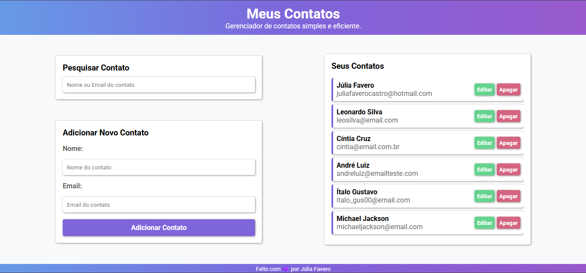
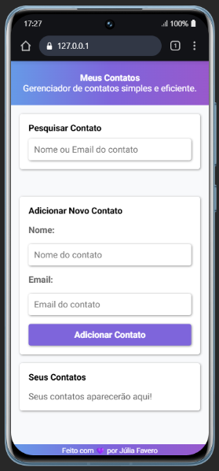

# 📇 My Contacts (Contact Manager)


 

> A simple (CRUD) contact manager built with HTML, CSS, and vanilla JavaScript, featuring data persistence using `localStorage`.

This project is a complete front-end application that allows a user to manage a contact list. It was built without frameworks, focusing on direct DOM manipulation and local storage.

## ✨ Features

* **Full CRUD:** Add, Read (list), Update (edit), and Delete contacts.
* **Real-time Search:** Instantly filter the contact list by name or email.
* **Data Persistence:** Contacts are saved in the browser's `localStorage` and persist after a page reload.
* **Responsive Design:** The layout adapts from a two-column desktop view to a single-column mobile view using Media Queries.

## 🛠 Tech Stack

* **HTML5:** Semantic structure for the application.
* **CSS3:** Styling with Flexbox and Media Queries for responsiveness.
* **JavaScript (Vanilla):** Used for all application logic:
    * DOM manipulation (creating, updating, and removing elements).
    * Event handling (clicks, inputs).
    * CRUD logic on the contacts array.
* **`localStorage` API:** To save and load contact data.

## 🏃 Getting Started

This is a pure front-end project and requires no installation.

```bash
# 1. Clone this repository
$ git clone [REPOSITORY_URL]

# 2. Navigate to the project folder
$ cd [PROJECT_NAME]

# 3. Open the 'index.html' file in your browser
```

## 📄 License

This project is licensed under the MIT License.


# 🇧🇷 Versão em Português

# 📇 Meus Contatos (Contact Manager)


> Um gerenciador de contatos simples (CRUD) construído com HTML, CSS e JavaScript puro, com persistência de dados no `localStorage`.

Este projeto é um aplicativo front-end completo que permite ao usuário gerenciar uma lista de contatos. Ele foi construído sem frameworks, focando na manipulação direta do DOM e no armazenamento local.

## ✨ Funcionalidades

* **CRUD Completo:** Adicionar, Ler (listar), Atualizar (editar) e Excluir contatos.
* **Pesquisa em Tempo Real:** Filtre a lista de contatos instantaneamente por nome ou email.
* **Persistência de Dados:** Os contatos são salvos no `localStorage` do navegador e não desaparecem ao recarregar a página.
* **Design Responsivo:** O layout se adapta a telas de desktop (duas colunas) e dispositivos móveis (coluna única) usando Media Queries.

## 🛠 Tecnologias Utilizadas

* **HTML5:** Estrutura semântica da aplicação.
* **CSS3:** Estilização com Flexbox e Media Queries para responsividade.
* **JavaScript (Vanilla):** Usado para toda a lógica do aplicativo:
    * Manipulação do DOM (criar, atualizar e remover elementos).
    * Gerenciamento de eventos (clicks, inputs).
    * Lógica de CRUD no array de contatos.
* **`localStorage` API:** Para salvar e carregar os dados dos contatos.

## 🏃 Como Rodar o Projeto

Este é um projeto puramente front-end e não requer instalação.

```bash
# 1. Clone este repositório
$ git clone [URL_DO_REPOSITORIO]

# 2. Acesse a pasta do projeto
$ cd [NOME_DO_PROJETO]

# 3. Abra o arquivo 'index.html' no seu navegador
```

## 📄 Licença

Este projeto está sob a licença MIT.
